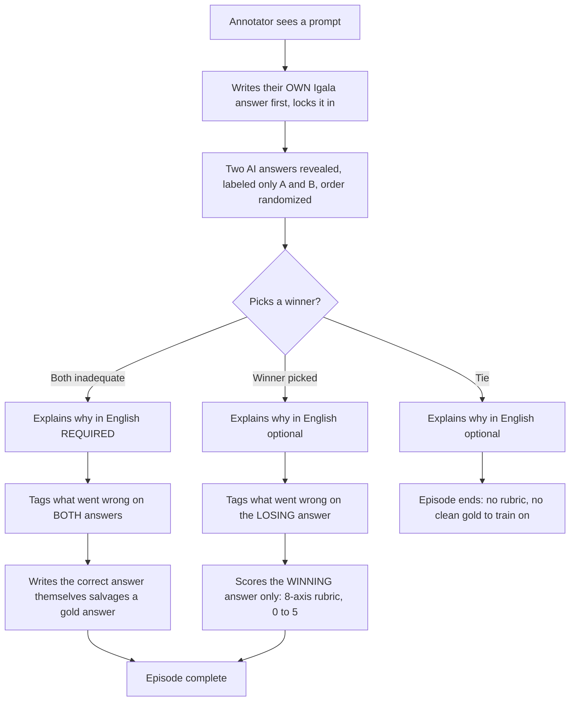
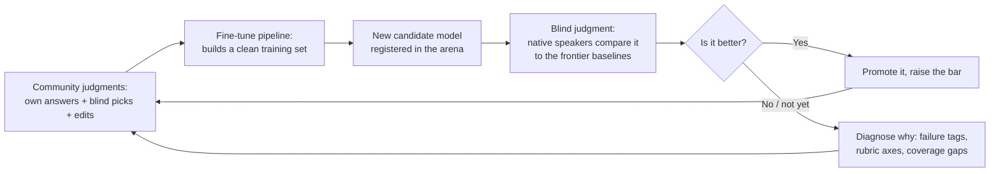
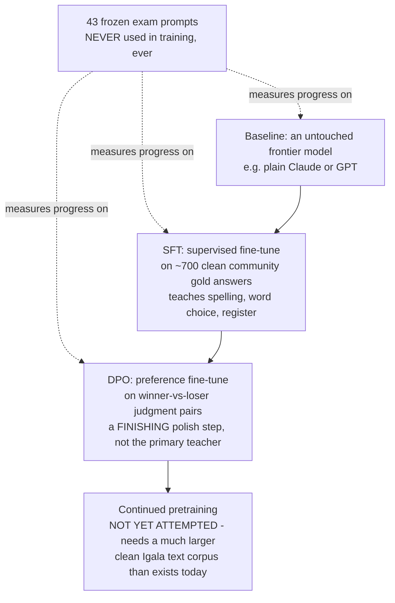

# Wikitongues AI / Igala: where we're at

Briefing for anyone who asks "where are you, what have you done, what's the goal, what's next." Written to be read cold, with no prior context. Live numbers below were pulled directly from the production database on 2026-08-09; everything else describes what has actually shipped, not what is planned.

---

## 1. The goal

Wikitongues and Halim Madi are working with Igala-speaking communities in Kogi State, Nigeria (Igala has roughly 2 million speakers) to teach an AI language model to actually speak Igala, and to build a public scoreboard that holds every major AI model, Claude, GPT, Gemini, and any future model, accountable for how well or badly it does. This is not a generic "AI for languages" demo. It is a community-run process: native Igala speakers write the training examples themselves, judge the AI's attempts blind (without knowing which answer came from which model), and every one of those judgments becomes the data that trains the next, better attempt. The public target is a live demo at the Wikimedia Foundation conference in Ghana in October 2026, where anyone can watch a model answer in Igala and see native speakers judge it in real time.

Here is the honest bar for October, stated plainly so nobody is misled by a good demo moment: the goal is **not** a model that is fluent in Igala. Fluency is not something the amount of data collected so far can buy. It is a model that **consistently produces real Igala, spelled and toned correctly, in the right social register (the right level of formality and respect)**, and that native speakers, not us, judge to have cleared that bar. "Consistently gets the basics right, and speaks with the correct written form and correct register" is the whole claim. Anything beyond that would be overclaiming.

---

## 2. Why this is hard

Three facts explain why this project exists and why it is a genuinely hard problem, not a small gap to close:

**Igala is not in any of the major multilingual AI training or evaluation datasets.** The big public resources that give AI models most of their "knowledge" of the world's languages, NLLB, MADLAD-400, and Glot500 (three of the largest efforts, built by Meta, Google, and academic researchers, to cover as many of the world's languages as possible), were all independently checked and confirmed to exclude Igala entirely. Most low-resource languages have at least a little data circulating in these sets. Igala has essentially none. This is the founding fact of the whole project: the models are not bad at Igala, they have almost never seen it.

**We tested this directly, blind, with native speakers, and the models failed almost every time.** Out of **781 blind, side-by-side comparisons** collected so far (a native Igala speaker sees two anonymous AI answers to the same question, in random order, and picks the better one, or says both are wrong), **776 (99.4%) ended with the speaker rejecting both answers or calling it a tie** rather than picking a winner. Only 5 comparisons produced a genuine winner. This is not a cherry-picked statistic; it is every comparison collected on the platform to date.

**When a model doesn't actually know Igala, it doesn't say so, it guesses a nearby language instead.** Annotators have repeatedly caught frontier models reaching for an Igala word and returning a word from Yoruba, Igbo, or Nigerian Pidgin instead, languages the model does know, that happen to be spoken nearby. One annotator, shown a wrong answer for "morning," said: "it's not an Igala word, maybe it's coming from Yoruba." That is not a one-off; it is the model's most common failure mode, and it means a naive glance at the output can look plausible, even culturally appropriate, while being confidently wrong. Catching this requires a native speaker in the loop, which is exactly what this platform is built around.

---

## 3. What we built

**The annotation platform.** This is the core instrument. Every time an annotator (a fluent or native Igala speaker on Agnes's team) sits down, they go through a guided "episode" with five steps, in this order:

1. **Own answer first.** Before seeing any AI output, the annotator writes their own Igala answer to the prompt, then locks it in. This "cold" answer cannot be contaminated by a model's phrasing, which matters because editing a bad AI answer tends to inherit that answer's awkwardness; writing one from scratch does not.
2. **Blind comparison.** Two AI answers are revealed, labeled only "A" and "B" in random order (the annotator does not know which model produced which). The annotator picks a winner, or says "tie," or says "both inadequate."
3. **English explanation.** The annotator writes, in English, why they picked what they picked. This is required when both answers are rejected.
4. **Failure tags.** A quick multi-select list of what specifically went wrong (not Igala at all, wrong language entirely, wrong word, wrong tone marks, invented/made up, bad grammar, culturally off, mixed with English). This turns "both wrong" from a dead end into a diagnosis, without asking the annotator to write an essay.
5. **Rubric, but only on the winner.** If there is a winner, that one answer (not both) gets scored on an 8-axis rubric, 0 to 5 per axis: grammar/word order, word choice, spelling, tone marks, meaning, cultural fit, authenticity, and whether it's really Igala or bleeding into another language. Scoring only the winner keeps each episode fast, which matters because the annotator team is working a fixed, modest volunteer budget.

**465 prompts across 8 categories** (spelling and tone marks, grammar and sentence structure, vocabulary and word meaning, dialect, register and politeness/honorifics, idioms and figurative language, cultural knowledge and values, and overall authenticity), covering everything from single-word vocabulary checks to open-ended cultural questions.

**The blind model arena**, a researcher-only tool that registers different model variants (a plain frontier model, the same model with a knowledge lookup added, a fine-tuned version) and ranks them against each other, per category, using only human blind judgments, statistically combined with a standard method (Bradley-Terry ranking, the same math used to rank chess players) so the comparisons are honest about how much confidence the sample size actually supports.

**The fine-tune pipeline**, the machinery that turns collected annotations into an actual training run: it pulls the community's approved gold answers, builds a clean training file (never training on prompts reserved for the exam, see Section 5c), sends it to a training provider, and automatically registers the resulting model back into the arena so it can be judged the same way as everything else.

**Researcher tooling**: a searchable annotation browser (every judgment, gold answer, and edit made on the platform, filterable and searchable, so a researcher can audit what came from whom), a time-tracking dashboard (estimates how many hours the volunteer team has actually put in), and a rubric reference page (the scoring guide, in plain language, that any annotator or researcher can check against).

**A public research page**, live on the web with no login required, that shows the project's real numbers automatically (not a snapshot someone has to remember to update) so a funder, a journalist, or a curious community member can see the state of the project themselves.

---

## 4. Where we are now (live numbers, checked 2026-08-09)

| Metric                                       | Number                                                                                                                                                                  |
| -------------------------------------------- | ----------------------------------------------------------------------------------------------------------------------------------------------------------------------- |
| Prompts in the bank                          | **465** (421 usable for training, 43 held-out "exam" prompts never used in training, 1 for calibration)                                                                 |
| Community-authored gold answers              | **937** (about 6,030 words total; about 4,940 words of that is usable for training once the exam-reserved answers are excluded)                                         |
| Blind comparisons collected                  | **781**                                                                                                                                                                 |
| Of those, rejected or tied (no clear winner) | **776 (99.4%)**                                                                                                                                                         |
| Of those, a clear winner picked              | **5** (2 for "A," 3 for "B")                                                                                                                                            |
| Registered annotators                        | **6 accounts**, plus Agnes (the community lead, registered with researcher access) who also annotates: **8 people have contributed judgments so far**                   |
| Held-out exam size                           | **43 prompts**, frozen since 2026-07-28, spread across all 8 categories, and guaranteed by the software itself (not just a promise) to never appear in any training run |
| Candidate models registered in the arena     | **9** (6 untouched frontier baselines from Claude, GPT, and Gemini, plus 3 fine-tuned attempts)                                                                         |

**Two fine-tuned models exist right now, and they are at very different stages:**

- A **Together AI / Qwen3-14B model**, trained on 318 community gold rows for **$4.00**. It finished training successfully, but it **cannot currently be served or tested**, because running a fine-tuned Qwen model for live answers needs a dedicated GPU server, and this Together account does not have permission to create one. The model exists; nobody can currently talk to it. This is an account-permissions problem, not a technical dead end, but it is unresolved.
- An **OpenAI gpt-4.1-mini model**, trained on 573 community gold rows for **$1.85**. This one **is live**: it has already generated answers to all 43 exam prompts, and it has been entered into annotators' normal blind-comparison queue (roughly two out of every three new comparisons an annotator gets now includes this model against a frontier baseline). It went live only in the last few days, so as of this writing only 2 of the 781 total comparisons have actually judged it yet; the real read on whether it's better will come from the comparisons still to be collected.

One early, encouraging, but not yet conclusive signal: on a rough measure of "how much of the text is actual Igala tone-marking versus not," the fine-tuned model's numbers shifted away from the frontier baselines and toward how the community's own gold answers actually look. That is consistent with the fine-tune nudging the model toward real community usage rather than a textbook-perfect but less natural style, but this is a proxy measurement, not a judgment from a native speaker, and only blind human judgment (in progress now) settles whether it is actually better.

---

## 5. The three diagrams

### (a) The annotation episode: what one annotator session looks like

In words: the annotator always writes their own answer before seeing the AI's, so their answer can never be biased by what the AI produced. Then they see the two AI answers blind and pick a winner, a tie, or reject both. If both are rejected, they must explain why in English and write the correct answer themselves, which becomes a new piece of training data. If there's a winner, only that one answer gets the detailed 8-axis quality score, keeping the process fast.

### (b) The data flywheel: how the platform's own use becomes the training data

In words: every annotation session produces training data as a side effect of judging quality. That data trains a candidate model. The candidate model is judged the exact same way the frontier models were judged, blind, by native speakers, not by us and not by an automated score. If it's better, it becomes the new benchmark to beat; if not, the failure tags and rubric scores tell us specifically what to fix, and that fix comes from collecting more of the right kind of community data. The loop is the product; there is no separate "collect data, then later build the model" phase.

### (c) The method ladder: how a model is actually taught, and how progress is proven

In words: this is a ladder, not a single trick. The starting point is an untouched frontier model, which fails almost every exam question (Section 2). The first real rung is supervised fine-tuning (SFT): training directly on several hundred clean, community-written correct answers, which teaches the model concrete things like correct spelling and the right level of formality. The next rung, DPO, trains on the "which answer did the community prefer" comparisons instead of on correct answers directly; it is a smaller, finishing adjustment, not something that can teach a model a language it doesn't have yet. A further rung, continued pretraining (essentially, showing the model a large amount of raw Igala text so it absorbs the language more deeply, not just this project's Q&A pairs), would likely matter a great deal, but it needs far more clean Igala text than the project currently has collected or has permission to use, so it has not been attempted. At every rung, the same 43 frozen exam prompts are used to measure whether the new version is actually better, so "we improved it" is a claim the data can back up, not just something we say happened.

---

## 6. Next steps

### For annotators (Agnes's team)

1. **Always give the English meaning.** Every locked Igala answer now requires a short English gloss (what it means and why) before it can be saved. This is what lets researchers who don't yet speak Igala audit and organize the training data responsibly; keep providing it even where it feels obvious.
2. **Label the dialect.** A dialect selector now exists on the "your answer" step. It is still provisional (Lydia and Agnes have not yet finalized the list of dialects), but start using it consistently, and flag anything on the list that looks wrong or incomplete so it can be corrected before it becomes a fixed taxonomy.
3. **Use the failure tags whenever both answers are wrong.** This is the fastest way to turn "both inadequate" from a dead end into a specific, usable diagnosis (wrong language entirely, wrong tone marks, invented content, and so on). It takes seconds and it is far more useful to us than the English explanation alone.
4. **Write LONG answers on the new long-form prompts, paragraphs, not single words.** This is the single biggest gap in the corpus right now: essentially all of the community gold collected so far is single words or single sentences, and almost none of it (about 1 answer out of 937) is multiple sentences long. A model trained only on short answers cannot learn to write a real paragraph, a folktale opening, or a full explanation of a proverb, no matter how much short-answer data it sees. The new long-form prompts are specifically asking for this; please lean into writing full, natural, multi-sentence answers on them, even though it takes longer per answer.
5. **Author prompts in Igala yourselves.** Almost all current prompts were written in English by the researchers, and then answered in Igala. The project needs prompts written in Igala from the start, by the community, both because it produces a genuinely different (and better) kind of exam, and because "answer this Igala question I wrote myself" is a more natural task than "translate this English instruction," which is one of the reasons models sound stilted even when they get the vocabulary right.

### For researchers (Halim and Lydia)

1. **Hold the orthography convention session.** Igala does not yet have one universally agreed written standard among the annotator team; the same word has come back spelled three different ways from different annotators (for example, "Ọdudu," "Òdúdú," and "ódùdù" for the same word). This spelling disagreement compounds badly once annotators start writing longer, paragraph-length answers, so this needs to be settled with Lydia and the community before the long-form push scales up, not after.
2. **Build out the eval harness.** The tools that check a model's output automatically (for the wrong language entirely, for missing tone marks, for basic red flags) currently exist only as a first pass; they need to be strengthened so that judging progress does not depend entirely on manually reading every answer, while keeping the honest limit in place: no automated check can certify Igala quality, because no available tool actually knows the language. Automated checks stay a fast first filter; native speaker judgment remains the final word.
3. **Expand the corpus, including seeking permission to use existing Igala texts.** There is written Igala already in the world (books, community documents, possibly transcribed oral material) that could meaningfully expand what the model sees, but none of it should be used without explicitly securing permission and being clear about how it will be used. This is a governance step as much as a technical one, and it has not yet been done.
4. **Run the second retraining (run 2).** Once the orthography session, the long-form prompts, and the community-authored prompts have produced a meaningfully larger and cleaner gold set, retrain. This second-generation model, not the current one, is the one intended to be shown publicly in October.
5. **Deliver the October Wikimedia Ghana demo.** The public unveiling, at the Wikimedia Foundation conference in Ghana around early October 2026, is the deadline everything above works backward from. It should show the real, current state of the model, including its honest limitations, judged live or near-live by native speakers, rather than a cherry-picked best case.

---

## 7. Open questions we genuinely do not know the answer to yet

- **Does more training data keep helping, or does this approach plateau?** With roughly 700 usable community-written examples, we are still on the steep part of the learning curve. Whether another few hundred examples produces another clear jump, or whether the model plateaus without a much bigger raw-text corpus (continued pretraining, which is not yet attempted, see Section 5c), is unknown.
- **Is fine-tuning the model's weights or giving it a lookup reference (retrieval) the better long-term approach, especially for facts and cultural knowledge?** The arena is built specifically to answer this with evidence rather than opinion, but most of the 8 categories do not yet have enough blind comparisons to statistically distinguish a real difference from noise. Only the largest gaps are currently measurable with confidence.
- **What is correct written Igala, exactly?** There isn't yet a single agreed spelling standard among the annotator team itself (see Section 6, item 1). This is a real, unresolved linguistic question the project has to help work through with the community, not something that can be assumed as a fixed input.
- **Does dialect matter for training and scoring, or is it a smaller concern?** A dialect field now exists on the platform, but the list of dialects is explicitly provisional, pending sign-off from Lydia and Agnes. Whether dialect differences meaningfully change what "correct" Igala looks like for training purposes is still open.
- **Can we get permission to use existing written Igala text?** Unresolved, and treated as a hard gate: nothing gets ingested without explicit permission, so the answer directly affects how much the corpus can grow beyond what the community writes fresh on the platform.
- **Is the volunteer annotator team's time budget enough to do everything being asked of it?** The team is working a fixed, modest number of volunteer hours per week. Long-form answers and self-authored prompts (Section 6) both take meaningfully longer per item than the short answers collected so far. Whether the current pace can deliver enough long-form, community-authored data before October, or whether the scope or timeline needs to flex, has not been settled.
- **Is the $4.00 spent on the Together/Qwen model recoverable?** The model trained successfully but cannot be served without a GPU endpoint this account cannot currently create. Whether that gets resolved, or whether that path is abandoned in favor of the OpenAI route that is already working, is an open decision, not yet made.

---

_Numbers in Section 4 were queried live from the production database (Supabase project `smytgqkgomsfyurskpcl`, schema `wikitongues`) on 2026-08-09. Everything else in this document reflects what has actually shipped and been verified, drawn from the project's own working history (`Context.md`, `web/Context.md`, and the `tasks/` research notes) as of that same date._
